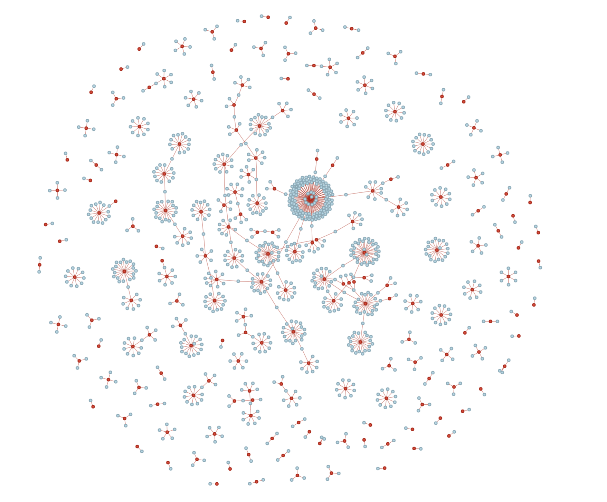

# Data Science Portfolio

## Education
- Ph.D, Mathematics | City University of New York (2018-present)
- B.S., Mathematics | University of Rochester (2013-2017)
- B.A., Financial Economics  | University of Rochester (2013-2017)

## Technical Skills: 
- Python, SQL, R, scikit-learn, PyTorch, Torch_geometric, Pandas, Matplotlib, Seaborn, MATLAB

## Techniques:
- Experimental Design, A/B test, Regression, Clustering, Pattern Recognition, Recommender System

## Work Experience
### Adjunct Professor @ Hunter College (_August 2020 - Present_)
- Instructor for courses including Statistics and Linear Algebra. Materials include experimental design, hypothesis test, dimension reduction, data science application, and [Python demonstrations](https://github.com/cocoxhuang/STAT213). An [example](https://github.com/cocoxhuang/STAT213/blob/main/chap10%20Hypothesis%20Testing%20Using%20a%20Single%20Sample.ipynb).

### Index Research Intern @ Nasdaq (_June 2016 - August 2016_)
- Provided support to internal cross-functional teams and external ETF fund managers through data collection, statistical analysis, and modeling, with a primary focus on summarizing index behaviors, including summary statistics and linear regression.
- Researched, developed, and presented the [Canada Dividend Achiever Index](https://indexes.nasdaqomx.com/Index/Overview/DACATR)  report including index description, calculation, evaluation, maintenance, and rebalancing, tailored for sales initiatives and investors' comprehensive analysis.

### Asset Management Intern @ Huatai Insurance (_June 2015 - August 2015_)
- Conducted research reports on investment opportunities in Fund of Funds (FoFs) for investment of funds.
- Contributed to the development and deployment of high-quality accounting automation to expedite delivery and improve efficiency.

## Projects
### GNN Predictive Modelling and Graph Data Mining
- Proposed a novel model integrating **graph discovery data mining** techniques and **Graph Neural Networks(GNNs)** to overcome limitations in graph structures for specific modeling tasks. By incorporating graph discovery models, the need for domain expertise in graph generation was also eliminated, resulting in significant time and effort savings compared to manual graph creation.
- It demonstrated a minimum of 15% improvement of the baseline Light Gradient Boosting Machine (LightGBM) and Neural Net models in a short-term intraday **Realized Volatility (RV)** prediction task by using 150 million records Limit Order Book (LOB) and trade data.


This is a network discovered using the [Glasso algorithm](https://jerryfriedman.su.domains/ftp/glasso-bio.pdf) from the [Kaggle Optiver Realized Volatility Prediction](https://www.kaggle.com/competitions/optiver-realized-volatility-prediction) dataset.

### Graph Discovery Python Library
- Created [SmoothLaplacian](https://github.com/cocoxhuang/Smooth-Laplacian) Python network analysis library, facilitating efficient underlying network discovery of diverse data. This tool streamlined the process of extracting network features from complex datasets.
- It is a Python implementation of [Learning Laplacian Matrix in Smooth Graph Signal Representations](https://arxiv.org/pdf/1406.7842.pdf)

### Recommender System for Advertising
- Developed a **Graph Neural Networks (GNNs) based recommender system** connecting businesses with social media influencers by learning various aspects of their social media behaviors such as **text caption, image, and the social relationship** among influencers and brands.
- Specifically, the model obtained the representations of businesses and social media influencers by Light Graph Convolutional Networks (LightGCNs).
- Collected and cleaned a dataset comprising 50GB pool of raw user profiles and posts collected from over 1427 businesses, and 16774 influencers.
- Extracted features from social media user behaviors by employing pretrained Natural Language Processing (NLP) and computer vision (CV) models.

This is a network consisting of selected brands and influencers from our dataset. For an interactive version of this network, see [here](https://www.dropbox.com/s/r9vyj12ymbib1m9/Brand_Influerncer_Network.html?dl=0).

### Estimation and Optimization of Time Series Models
- Used a Simulated Minimum Distance (SMD) estimator based on the Wasserstein distance, **Wasserstein Distance Estimator (WDE)**, between the model-simulated distribution and the empirical distribution.
- The method resolved common challenges posed by intractable analytical likelihood functions by implementing the Wasserstein distance estimator for complicated time series models, ensuring accurate estimations where Maximum Likelihood Estimator (MLE) fell short.
- The method outperformed existing estimation methods, both in terms of accuracy and computational time (2 - 100x faster). Models estimated include AR(1) model, ARMA(2, 2)-ARCH(2), random walks with a structural break and 10 years S&P 500 data.

